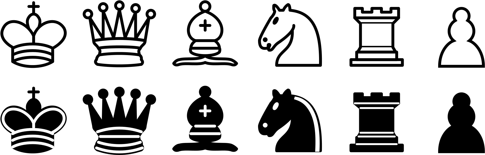

# Piece Data Layout

| Bit 0 | Bit 1 | Bit 2 | Bit 3 | Bit 4 | Bit 5 - 7 |
| :-----: | :-----: | :-----: | :-----: | :-----: | :-----: |
| lastMoved | hasMoved | canMoveHighlight | selectHighlight | Color | Type |

